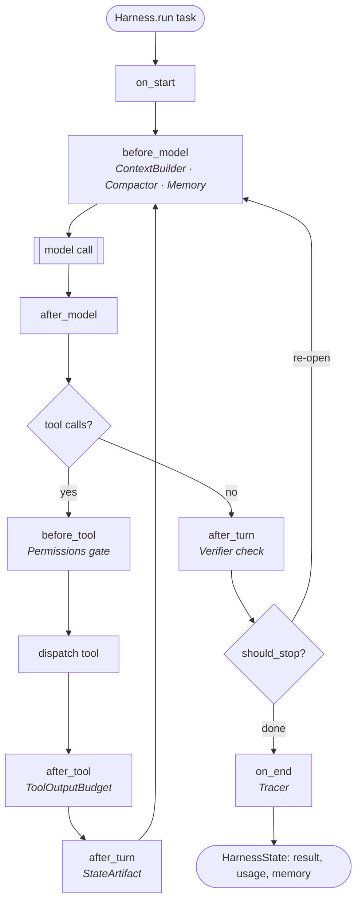

<div align="center">

# pyhar

**Composable primitives for agent harnesses.**

The swappable parts — compaction, tool-output budgeting, verification, memory,
permissions, tracing — that every serious agent's harness re-implements by hand,
packaged as small typed modules behind **one interface** that drops into *any* loop.

[](https://github.com/ChaoYue0307/pyhar/actions/workflows/ci.yml)


</div>

> **Not another agent framework.** pyhar owns only the model-facing scaffolding.
> Bring your own runtime (a plain `while` loop, LangGraph, the OpenAI SDK) and
> your own tools (MCP). It **composes _with_ your framework, not against it.**

```bash
pip install pyhar-agents        # then:  import pyhar
```

---

## Contents

- [Why](#why) · [The keystone: `Component`](#the-keystone-component) · [The loop](#the-loop)
- [Quickstart](#quickstart) · [Use cases](#use-cases) · [Components](#components) · [Model backends](#model-backends)
- [Compose with your runtime & MCP](#compose-with-your-runtime--mcp) · [The measured win](#the-measured-win)
- [Docs](#docs) · [Design principles](#design-principles) · [Install](#install)

---

## Why

An agent is `Model + Harness`. Today the *harness* — the code around the model —
is where reliability actually comes from, yet nobody ships it as reusable parts.
Every layer of the 2026 stack is crowded except one:

| Layer | Who owns it |
| --- | --- |
| Agent products ("the harness") | Claude Code · Devin · deepagents (closed / bundled) |
| Orchestration runtime | LangGraph · OpenAI/MS/Google SDKs · CrewAI (crowded) |
| **Harness components** | **← unowned. This is pyhar.** |
| Programming / compiler | DSPy · TextGrad · GEPA |
| Model + tools | MCP (settled) |

pyhar relates *all* those agents' harnesses under one representation: a harness
is just an **ordered composition of shared `Component` parts**. Swap a part, keep
everything else.

## The keystone: `Component`

`Component` is the "`nn.Module` of harnesses" — it hooks into the agent loop
lifecycle; every hook has a no-op default, so you override only what you need.

```python
class Component:
    def on_start(self, state): ...                      # once, before the first model call
    def before_model(self, state): ...                  # shape context (compaction, retrieval)
    def after_model(self, state, response): ...          # inspect the model output
    def before_tool(self, state, call) -> str | None: ...# gate a tool call — return a str to DENY
    def after_tool(self, state, call, result): ...        # transform a tool result (budget it)
    def after_turn(self, state): ...                     # verify, checkpoint, write memory
    def should_stop(self, state) -> bool | None: ...      # vote on stopping (Verifier re-opens here)
    def on_end(self, state): ...                         # once, after the loop ends
```

## The loop

`Harness.run()` weaves the component lifecycle into a standard tool-calling loop.
The hooks (and which built-in components fire on each) map like this:



The same `Component` objects also run in your own loop — nothing here is
locked to pyhar's runtime (see [Compose with your runtime & MCP](#compose-with-your-runtime--mcp)).

## Quickstart

No API key needed — pyhar ships a `ScriptedModel` so every example runs offline.

```python
from pyhar import ScriptedModel, tool
from pyhar.presets import coding_agent

@tool
def read_file(path: str) -> str:                 # schema auto-generated from type hints
    return "decision: use SQLite\n" + "log\n" * 400 + "TODO: add index"

model = ScriptedModel([
    ("tool", "read_file", {"path": "db.py"}),    # a tool call
    "Done. The answer is 42.",                   # then a final answer
])

def check(state):                                # your verification — tests, eval, judge…
    return ("42" in (state.result or ""), "answer must contain '42'")

harness = coding_agent(model, tools=[read_file], check=check, context_tokens=300)
state = harness.run("Inspect db.py and tell me the answer.")

print(state.result)                 # -> "Done. The answer is 42."
print(state.memory["_tool_savings"])# tokens saved by tool-output budgeting
print(state.usage)                  # Usage(input_tokens=…, output_tokens=…, cost=…)
```

Swap `ScriptedModel` for `AnthropicModel("claude-opus-4-8")`, `OpenAIModel(...)`,
or `OllamaModel(...)` to run against a real model — nothing else changes.

## Use cases

| You want to… | Reach for | One-liner |
| --- | --- | --- |
| Stop a 50 KB tool result from blowing up context | `ToolOutputBudget` | shrinks oversized results, stashes the full output in a sandbox |
| Never let the agent run destructive tools | `Permissions` | allow/deny lists or a policy callback, gated *before* execution |
| Make the agent verify before it finishes | `Verifier` | runs *your* check; on failure injects feedback and retries |
| Survive context limits on long runs | `Compactor` + `StateArtifact` | compact in-window; persist decisions so a fresh context resumes |
| Give the agent memory across turns/sessions | `Memory` | pinned core block + keyword recall, storage-agnostic |
| See exactly what your agent did | `Tracer` | a structured event stream (with an optional live sink) |
| Tune a harness with numbers, not vibes | `bench` | A/B two configs on one task, report tokens/cost/turns |
| Reuse your scaffolding inside LangGraph | `adapters` | the same components as middleware |

A **safe, observable agent** is just a composition:

```python
from pyhar import Harness, Permissions, ToolOutputBudget, Tracer

harness = Harness(
    model,
    components=[
        Permissions(deny=["delete_everything", "shell"]),  # gate destructive tools
        ToolOutputBudget(max_tokens=400),                  # keep tool output small
        Tracer(sink=print),                                # live event log
    ],
    tools=[...],
)
state = harness.run(task)
state.memory["_denied"]   # what was blocked
state.memory["_trace"]    # the full event stream
```

## Components

| Component | What it packages | Hook |
| --- | --- | --- |
| `Compactor` | staged compaction — trim tool outputs, then collapse history preserving decisions + open items | `before_model` |
| `ToolOutputBudget` | shrink oversized tool results, stash full output in a sandbox (the seam MCP leaves open) | `after_tool` |
| `Verifier` | verify→retry driven by *your* check (tests / eval / judge), not just schema shape | `after_turn` / `should_stop` |
| `Permissions` | allow/deny lists or a policy callback; gate tools before they run | `before_tool` |
| `ContextBuilder` | budget-aware per-step context assembly (system prompt, retrieval, window trimming) | `before_model` |
| `Memory` | tiered core/recall/archival (Letta / LangMem mental model), storage-agnostic | `on_start` / `before_model` |
| `StateArtifact` | externalized progress + decisions so a fresh context reconstructs "where am I" (`MemoryStore` / `FileStore`) | `on_start` / `after_turn` |
| `BudgetPolicy` | explicit token/cost ceilings + soft-warning hook for model tiering | `after_turn` |
| `Tracer` | structured event stream for observability, optional live `sink` | all hooks |
| `Harness` | the batteries-included loop that runs a composition | — |
| `subagent_tool` | expose an isolated sub-harness as a `Tool` (return-only-relevant-excerpt) | — |
| `bench` | A/B two harness configs on one task; report tokens/cost/turns | — |

Full reference with constructor arguments and runnable snippets → **[docs/components.md](docs/components.md)**.

## Model backends

A `Model` is anything mapping messages + tools to a `Response`. Provider SDKs are
**optional extras**, lazy-imported — `import pyhar` never requires them.

```python
from pyhar.models import AnthropicModel, OpenAIModel, OllamaModel

AnthropicModel("claude-opus-4-8")               # pip install "pyhar-agents[anthropic]"
OpenAIModel("gpt-4o-mini")                      # pip install "pyhar-agents[openai]"
OpenAIModel("my-model", base_url="http://localhost:8000/v1")  # vLLM / Together / LM Studio
OllamaModel("llama3.1")                         # local OSS, zero dependencies
```

| Backend | Notes |
| --- | --- |
| `AnthropicModel` | official SDK; adaptive thinking + `effort`, no `temperature`/`budget_tokens`; default `claude-opus-4-8` |
| `OpenAIModel` / `OpenAICompatibleModel` | OpenAI SDK; `base_url=` targets any OpenAI-compatible / OSS server |
| `OllamaModel` | local models over stdlib `urllib` — **zero dependencies** |
| `ScriptedModel` / `EchoModel` | deterministic, key-free — tests, examples, CI |

Writing your own is ~10 lines → **[docs/models.md](docs/models.md)**.

## Compose with your runtime & MCP

pyhar's own loop is a convenience. Because components are plain objects with
lifecycle hooks, drive them from anywhere:

```python
from pyhar.adapters import component_hooks, to_langgraph_middleware
from pyhar.mcp import tools_from_mcp

hooks = component_hooks([Compactor(...), ToolOutputBudget(...)])  # drive from your own loop
mw    = to_langgraph_middleware([Compactor(...)])                 # experimental: LangGraph middleware
tools = tools_from_mcp(mcp_descriptors, call_tool)                # import MCP tools as Tool objects
```

Details, subagents, and the OpenAI-Agents binder → **[docs/adapters-and-mcp.md](docs/adapters-and-mcp.md)**.

## The measured win

pyhar's design rule is *measured, not asserted* — `bench` exists so claims are
reproducible numbers. From `examples/bench_demo.py` (identical task and model,
the only difference being two added components):

```text
config                ok   turns  in_tok   out_tok  cost
-------------------------------------------------------------
baseline              yes  2      2166     40       0.0000
tuned (budget+compact)yes  2      247      40       0.0000

input tokens saved by the primitives: 1919 (89%)
```

Run it yourself:

```bash
python examples/react_agent.py            # full coding-agent harness
python examples/minimal_loop.py           # SAME components, a hand-rolled loop
python examples/permissions_and_tracing.py# gated + traced agent
python examples/bench_demo.py             # the A/B above
python examples/memory_and_state.py       # resume across a fresh context
python examples/real_model.py             # Anthropic / OpenAI / Ollama by env
pytest                                    # 38 tests, no keys needed
```

## Docs

| Guide | What's in it |
| --- | --- |
| **[Concepts](docs/concepts.md)** | the mental model, the `Component` interface, `HarnessState`, the loop step-by-step |
| **[Components](docs/components.md)** | reference for every built-in component (args, hooks, snippets) |
| **[Model backends & tools](docs/models.md)** | the `Model` protocol, each backend, auto tool-schemas, writing your own |
| **[Adapters, MCP & subagents](docs/adapters-and-mcp.md)** | `component_hooks`, LangGraph / OpenAI-Agents binders, MCP, subagents |
| **[Cookbook](docs/cookbook.md)** | task-oriented recipes you can copy |

## Design principles

1. **Narrow waist.** Model-facing scaffolding only — never the runtime or the tool standard.
2. **Adopt one part at a time.** Every component works standalone and in any loop.
3. **Measured, not asserted.** `bench` makes "60% fewer tokens" a number you can reproduce.
4. **Zero required runtime dependencies.** Bring your own model and tools.

## Roadmap

Shipped: model backends, runtime adapters (+ experimental LangGraph / OpenAI-Agents),
MCP interop, and the `ContextBuilder` / `Memory` / `StateArtifact` / `Permissions` /
`Tracer` / `subagent_tool` primitives, with automatic tool schemas.

Deferred: a torchvision/timm-style **registry** (needs adoption critical mass — a
seed lives in `pyhar.registry`), **runtime-structure optimization** ("autograd from
production traces", the v2 bet), and **hardened framework adapters** (the binders
stay experimental until pinned to a released middleware surface).

## Install

The distribution is **`pyhar-agents`** on PyPI; the import name is **`pyhar`**.

```bash
pip install pyhar-agents               # then:  import pyhar
pip install "pyhar-agents[anthropic]"  # + the Anthropic backend
pip install "pyhar-agents[openai]"     # + the OpenAI backend
```

## Contributing

See [CONTRIBUTING.md](CONTRIBUTING.md). The bar for a new primitive: *does it
implement `Component`, work standalone, and drop into any loop?*

## License

MIT — see [LICENSE](LICENSE).
